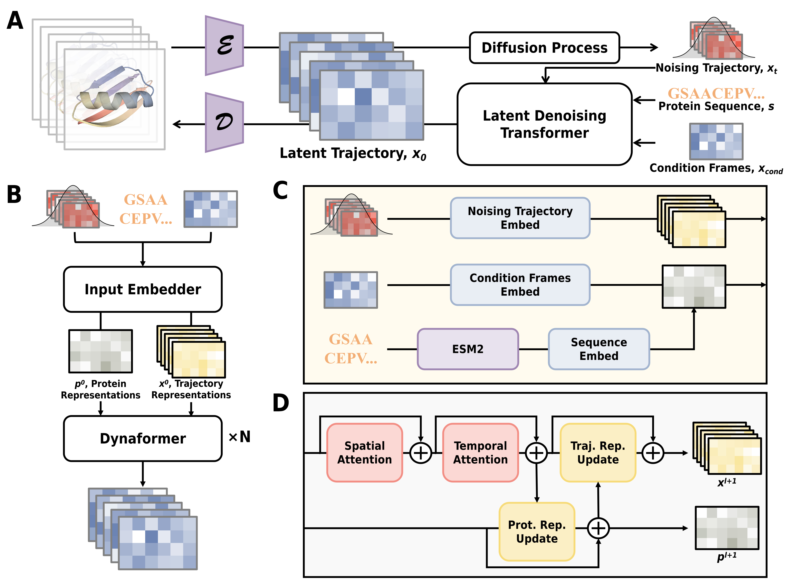

# DynaFold: A Latent Diffusion Based Generative Framework for Protein Dynamic Trajectory

This repository contains code for ["DynaFold: A Latent Diffusion Based Generative Framework for Protein Dynamic Trajectory"](https://www.biorxiv.org/content/10.1101/2025.09.14.676071), which introduced a latent diffusion based framework for generating all-atom protein structural trajectories and ensembles. Specifically, DynaFold can model:
- Forward Simulation Trajectories: Accepts an initial backbone structure and samples subsequent simulated trajectories
- Conformation Transition Pathways: Accepts initial and final structures and samples transition paths between given conformations
- Structural Ensembles: Accepts amino acid sequences, preprocessed using ESM2, and predicts a set of potential protein structures


## Table of Contents

- [Installation](#installation)
- [Model Weights](#model-weights)
- [Inference](#inference)

## Installation

To set up an environment for DynaFold, run:
```bash
git clone https://github.com/Zirui-Fan/DynaFold.git
cd DynaFold
conda create -n dynafold python=3.12.10
conda activate dynafold
pip install -r requirements.txt
```

## Model Weights

DynaFold is a latent diffusion framework comprising a unified protein all-atom structure Variational Autoencoder (VAE) and various Latent Denoising Models (LDTs) tailored for different tasks. We name the model weights as **DynaFold-{task type}**, where **forward simulation**, **conformational transition** and **ensemble** tasks are abbreviated as **FS**, **CT** and **ES** respectively. For the same task trained on different datasets, the dataset name will also be appended to the suffix. For DynaFold, model weights of VAE encoder, VAE decoder and [ESM2 650M](https://github.com/facebookresearch/esm) are indispensable. A repository containing all required model weights can be accessed at: [https://huggingface.co/Zirui-Fan/DynaFold].

### VAE Weights
| Model Name | Download Link |
|------------|--------------|
| Encoder | [https://huggingface.co/Zirui-Fan/DynaFold/blob/main/weights/encoder.pth] |
| Decoder | [https://huggingface.co/Zirui-Fan/DynaFold/blob/main/weights/decoder.pth] |
### LDT Weights
For models trained by Fast Folding dataset, we employed leave-one-out cross-validation (LOOCV) for evaluation. Therefore, there will be a model weight file with the same name as the test protein within FastFolding-suffix weights folders.
| Model Name | Download Link |
|------------|--------------|
| DynaFold-FS-ATLAS | [https://huggingface.co/Zirui-Fan/DynaFold/blob/main/weights/DynaFold-FS-ATLAS.pth] |
| DynaFold-FS-FastFolding | [https://huggingface.co/Zirui-Fan/DynaFold/tree/main/weights/DynaFold-FS-FastFolding] |
| DynaFold-CT | [https://huggingface.co/Zirui-Fan/DynaFold/blob/main/weights/DynaFold-CT.pth] |
| DynaFold-ES-Pretrain | [https://huggingface.co/Zirui-Fan/DynaFold/blob/main/weights/DynaFold-ES-Pretrain.pth] |
| DynaFold-ES-ATLAS | [https://huggingface.co/Zirui-Fan/DynaFold/blob/main/weights/DynaFold-ES-ATLAS.pth] |
| DynaFold-ES-FastFolding | [https://huggingface.co/Zirui-Fan/DynaFold/tree/main/weights/DynaFold-ES-FastFolding] |
## Inference
### Forward Simulations and Ensembles

`inference.py` is used for DynaFold's forward simulation (DynaFold-FS) and ensemble (DynaFold-ES) models. The basic inference command for running **DynaFold-ES** is:
```python
python inference.py \
--input ./example/ATLAS \
--out_dir ./results \
--esm_model_path ./esm2/weights/esm2_t33_650M_UR50D.pt \
--encoder_ckpt ./weights/encoder.pth \
--decoder_ckpt ./weights/decoder.pth \
--ldt_ckpt ./weights/DynaFold-ES-ATLAS.pth \
--T 100
```
Where `--T` denotes the number of sampled structures or tracjetory frames. For **DynaFold-FS**, the additional parameters `--use_cond` and `--temp_attn` must be supplied, specifying the use of conditional frames and temporal attention mechanisms within the LDT model respectively. The basic inference command for running **DynaFold-FS** is:
```python
python inference.py \
--input ./example/ATLAS \
--out_dir ./results \
--esm_model_path ./esm2/weights/esm2_t33_650M_UR50D.pt \
--encoder_ckpt ./weights/encoder.pth \
--decoder_ckpt ./weights/decoder.pth \
--ldt_ckpt ./weights/DynaFold-FS-ATLAS.pth \
--T 201 --use_cond --temp_attn
```

### Conformational Transition Pathways

`inference_CT.py` is used for DynaFold's conformational transition (DynaFold-CT) models. The basic inference command for running **DynaFold-CT** is:
```python
python inference_CT.py \
--pdb0 ./example/FastFolding/CT/NLT9/start.pdb \
--pdbT ./example/FastFolding/CT/NLT9/end.pdb \
--out_dir ./results \
--esm_model_path ./esm2/weights/esm2_t33_650M_UR50D.pt \
--encoder_ckpt ./weights/encoder.pth \
--decoder_ckpt ./weights/decoder.pth \
--ldt_ckpt ./weights/DynaFold-CT.pth \
--T 50
```

## Contact
If you have any questions, please contact me via email: ziruifan@sjtu.edu.cn. Or open an issue in the GitHub repository.